# appSalud TSTEAM Peps 
## _APLICACIÓN JAVASCRIPT ,ASIGNATURA PEPS 

<p align="center">
<br>

</p>
<p align="center">

</p> 
<p align="center">☕️ Simple.flexible,fun javascript test Framework for node.js
</p>
<p align="center">

</p><br>


Esta aplicación simula una báscula y un paciente el cual introduce datos en la báscula. Puedes introducir nombre de usuario, apellidos, su peso,altura y la fecha se quedan guardados . Además recoge las veces que te registras, y además puede decirte
tu IMC según los datos introducidos.
- IMC (indice de masa corporal)
- Peso en kg
- Altura en cm (Ej: 180cm)
- Contador (Seguimiento de Medidas)
-✨ Aplicación de Alto rendimiento en javascript con test unitarios por módulos o por secciones del programa ✨

## Composición del Programa
- Carpeta AppSalud con todas las capturas de pantalla .
- carpeta Test con el archivo Bascula_test.js con los test unitarios.
- archivo bascula.js con la lógica del programa en javascript,mocha i chai. Hace falta unos pocos comandos para poder hacer funcionar este programa que se indican a continuación.
- README.md este mismo archivo con la configuración e instalación detallada.
- Otros archivos que se deberan instalar una vez clonado el repositorio (package.json y node)
- node_modueles una vez clonado el repo de github lanzar npm i para obtener la libreria de node.( Explicado más abajo)
AppSalud está hecho en javascript con los Frameworks [mocha] y [chai][df1] además de Node.js ,editado en Visual Studio Code con el fin de elaborar diferentes prueba error tests usando mocha y chai .

>Alto rendimiento con tecnologias punteras como (chai i mocha)
>Todo el Core del programa está comprimido en Bascula.js... y tiene los test con el check verde en bascula_test.js

## Features

Los test [assert] y [should] proporcionan seguridad y aprueba de errores, dejando un código limpio y seguro.

- [ Código Limpio ] - Javascript Puro
- [ Mocha ] - Test completos en bascula_tests
- [ Chai ] - Test Implemtando Assert , should ,etc
- [Node.js] - Node.js


## Instalación y Configuración de todo.

Proceso de Instalación e uso de AppSalud
```
Download Repository from Github
```

Instalar [Node.js](https://nodejs.org/) en caso de que no este Instalado y Inicializar
```
Requires Node.js (download e Install ) to setup.
Primero tenemos que Inicializar el proyecto, accedemos a la carpeta en este caso Caso-practico-mocha--appsalud-tsteam
Luego npm init (Para inicializar)
```

Instalar Mocha y Chai (Para Testing)

```
npm install mocha chai --save-dev
En la imagen siguiente aparece el comando usado para instalar mocha y chai

```
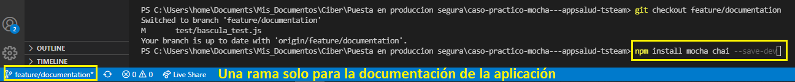


Install the dependencies npm i.
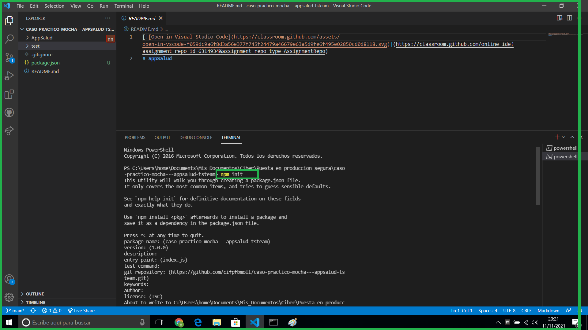

```sh

cd caso-practico--appsalud-tsteam
npm i
node_modules ya estará instalado
```

Configuración Package.json
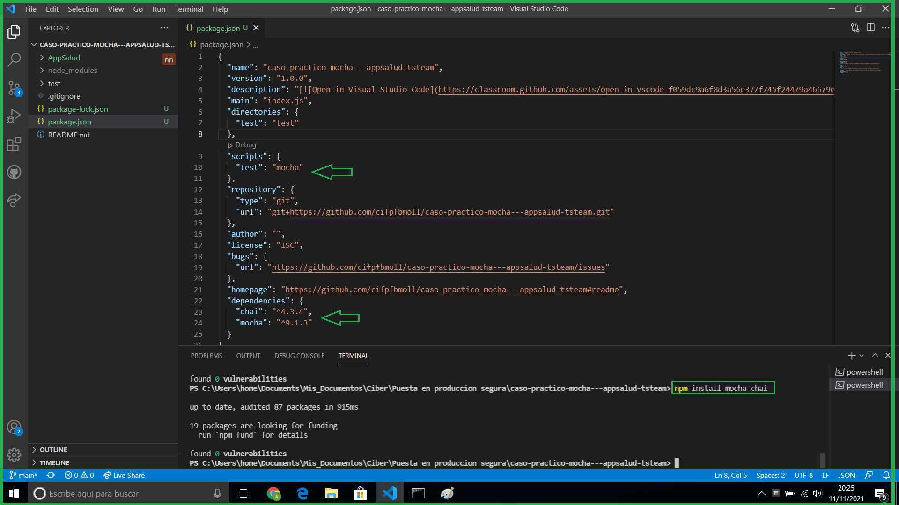

```sh

Editamos  package.json o desde visual Studio Code
en "test": "mocha"
Como indica la imagen.
```

Creación del Constructor (AppSalud)
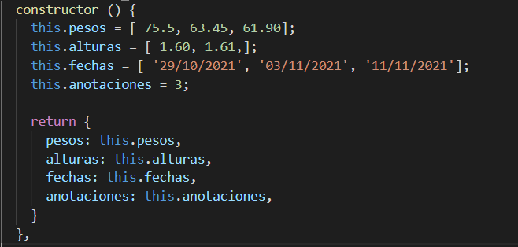

```sh

Como hay que crear una báscula o varias se crea este constructor de forma que inicialize con parámetros para así encontar el Max o Min de los parámetros introducidos. A continuación los diferentes métodos que incorpora la báscula .


```


## Arrays Donde Almacenamos los valores

```sh
+ Pesos[]: decimal
+ alturas[]:decimal
+ fechas[]:Date
+ anotaciones[]:Enteros


```

# Métodos de báscula (Funcionalidad)
## Método anotar Peso y Altura
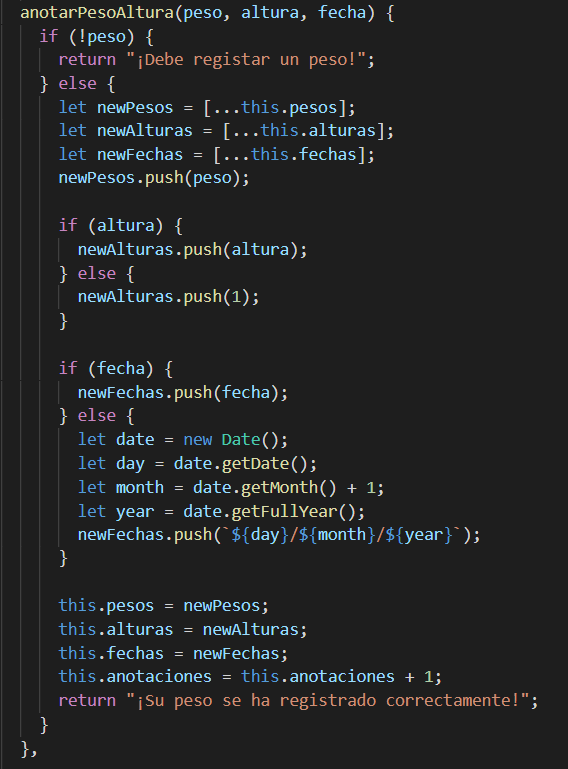

```sh
+ anotarPesoAltura() --> Lanzamos las pruebas test con pesos ya inizializados y alturas en el los arrays del constructor para buscar y detectar los valores máximos y mínimos.
```

## Método obtener Peso Máximo


```sh
+ obtenerPesoMaximo() --> Este método funciona así, si en el array de pesos tenemos los valores [90,80,110] saca el valor del  máximo .

```

## Método obtener Peso Mínimo
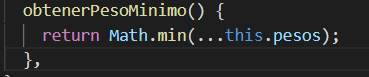
```
+ obtenerPesoMaximo() --> Este método funciona así, si en el array de pesos tenemos los valores [90,80,110] saca el valor del  máximo .

```

## Método Calcular IMC(Índice de Masa Corporal)

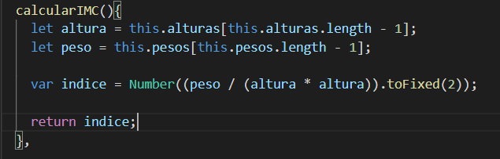
```
+ calcularIMC() --> Este método calcula Un índice de masa según la altura y el peso de cada persona. La fórmula es la siguiente
IMC = altura(2)/kg 
Se aplica Mocha i chai que aparece más abajo,
aquí solo mostramos el método usado.

```

## Método DescribirIMC(Índice de Masa Corporal )
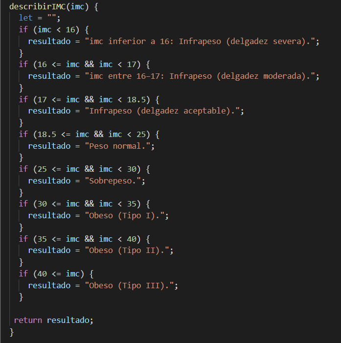
```
+ describirIMC(imc) --> Este método devuelve un String "frase" dependiendo del peso pasado, aquí se observa los rangos según el peso que devuelve.


```

Una vez que todos los métodos están implementados y funcionando, una vez que tenemos el costructor definido con valores en cada parametro, los parámetros son:pesos,alturas,anotaciones.

Las funciones o métodos obtenerPesoMáximo, obtenerAnotaciones, etc...

# Testing
## Testing Métodos Bascula "Constructor" (Aplicando Mocha & Chai )


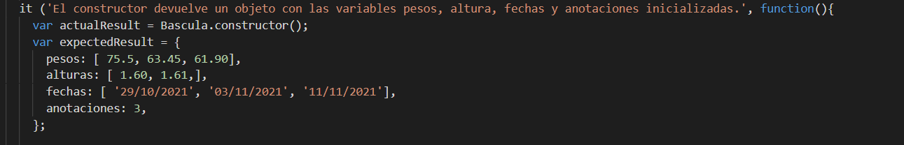
```
+ Lanzamos Bascula.constructor();
+ Inicializamos los valores de la báscula.


```

## Testing Métodos Báscula 

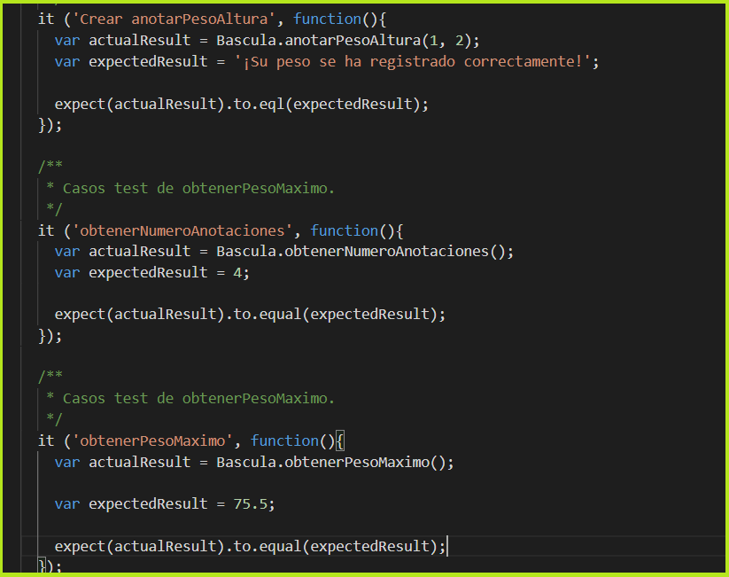
```sh
+ obtenerNumeroAnotaciones() --> Esto son las veces que se usa la báscula.
+ CrearAnotarPeso() --> Se guardan los pesos de cada paciente.
+ obtenerPesoMaximo() --> Lanza el método y devuelve el valor más grande del array.
+ obtenerPesoMinimo() --> Lanza el método y devuelve el valor mínio del array.
* El caso testing *it* empieza el caso test y con el 
expect(data).to.equal(data) compara los valores y pasa el test si son iguales.


```

# Paciente en AppSalud #

## Métodos del Paciente *Constructor*
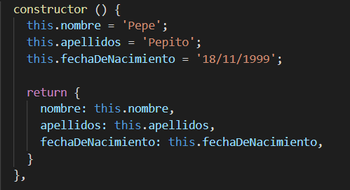
```
El constructor es simple tiene los valores según el ejercicio que estamos siguiendo, nombre,apellidos,fecha de nacimiento.

```

## Métodos del Paciente ModificarNombre()

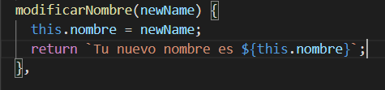

```sh
Este método sirve para modificar el Nombre del paciente

```
## Métodos del Paciente Saludar()

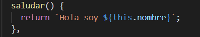

```sh
Este método lanza un saludo del paciente.

```

## Métodos del Paciente Cambiar Nombre()


```sh
Este método lanza la edad del paciente.

```

## Métodos del Paciente obtenerApellidos()

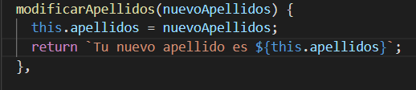

```sh
Este método lanza los apellidos del paciente.

```
## Métodos del Paciente obtenerFechaNacimiento()


```sh
Este método lanza los apellidos del paciente.

```

## Frameworks


AppSalud is currently extended with the following Frameworks.
Instructions on how to use them in your own application are linked below.

| Plugin | README |
| ------ | ------ |
| Mocha | [plugins/mocha.md][PlDb] |
| Chai | [plugins/chai.md][PlGh] |


